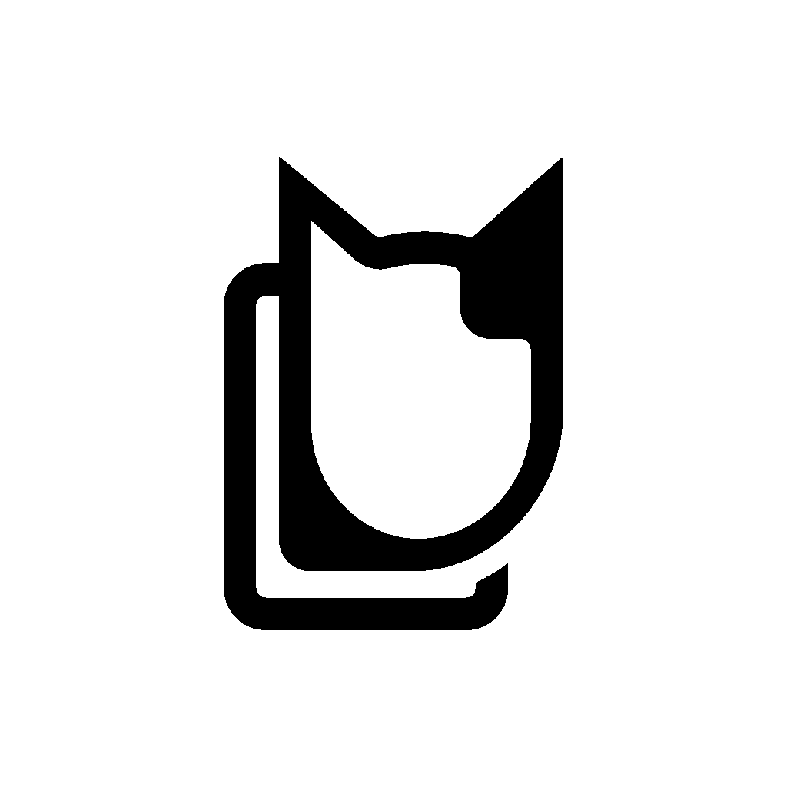
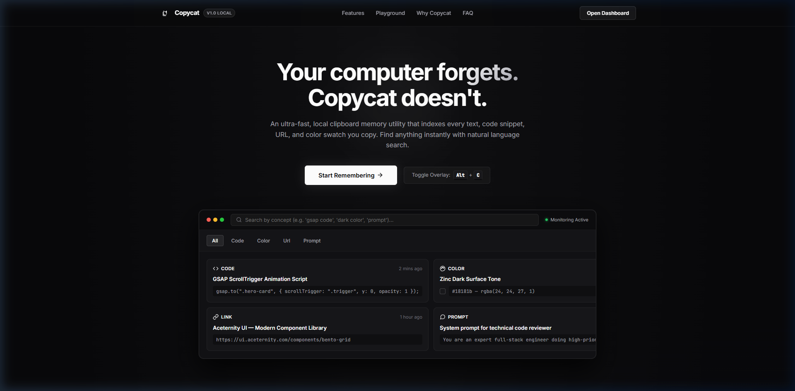
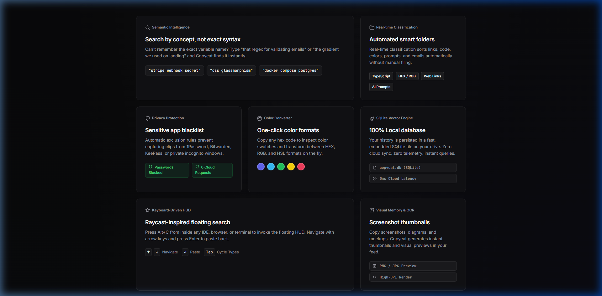
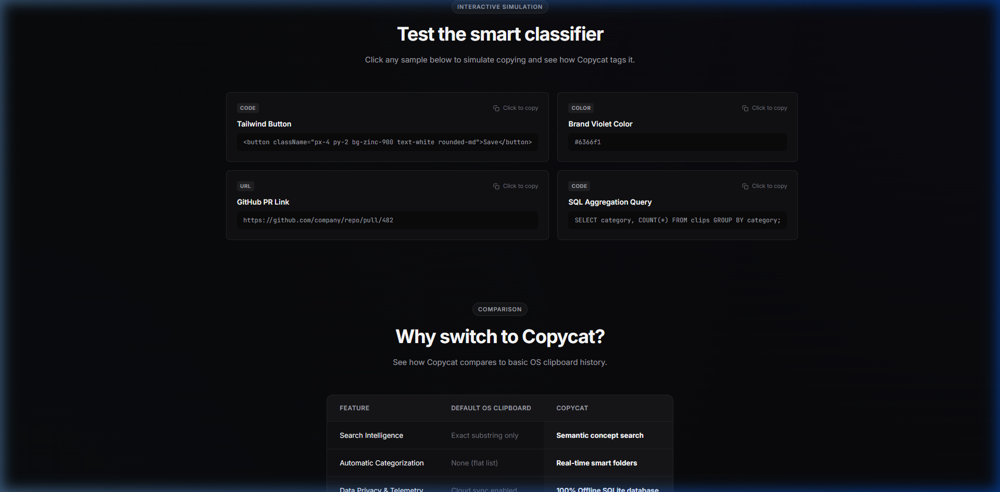
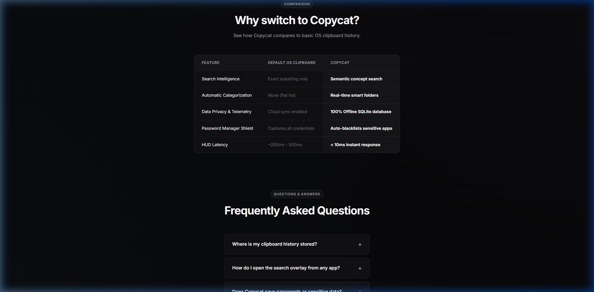

<div align="center">

  

  # Copycat

  **Your computer forgets. Copycat doesn't.**

  *An ultra-fast, local-first clipboard memory and semantic search HUD for developers.*

  <br />

  [](https://opensource.org/licenses/MIT)
  [](https://www.electronjs.org/)
  [](https://reactjs.org/)
  [](https://www.sqlite.org/)
  [](#-privacy--security)

</div>

<br />

---

## ⚡ Overview

**Copycat** is an intelligent, developer-first clipboard manager built with Electron, React, and an embedded WebAssembly SQLite engine. It silently monitors your clipboard, automatically classifies snippets into typed smart collections, and gives you instant global access via a floating search overlay.



---

## ✨ Key Features

### 🔍 1. Semantic Concept Search
Can't remember the exact syntax or variable name? Search by natural intent — type `"regex for validating emails"`, `"gradient used on hero"`, or `"docker compose postgres"` and find clips instantly in under 10ms.

### 📁 2. Real-Time Smart Folders
Clips are automatically recognized, formatted, and categorized as you copy:
- **Code**: Syntax detection for TypeScript, JavaScript, Python, SQL, HTML/CSS, JSON.
- **Colors**: One-click HEX, RGB, and HSL swatch inspection.
- **Web Links**: Clean URL previews with domain recognition.
- **AI Prompts**: Preserves multi-line prompt templates and context.



### ⌨️ 3. Raycast-Inspired Floating HUD
Press <kbd>Alt</kbd> + <kbd>C</kbd> anywhere on your system to invoke the keyboard-first floating overlay:
- <kbd>↑</kbd> <kbd>↓</kbd> Navigate search results seamlessly
- <kbd>↵ Enter</kbd> Paste snippet directly into your active editor or browser
- <kbd>Tab</kbd> Cycle through types (`All`, `Code`, `Colors`, `URLs`, `Prompts`)
- <kbd>Esc</kbd> Dismiss overlay instantly

### 🧪 4. Interactive Simulation Playground
Test smart classification and clipboard capture live right from the product dashboard:



---

## 🛡️ Privacy & Local-First Architecture

Copycat is built with a zero-compromise privacy model:

- **100% Offline SQLite**: All history and index tables are saved locally in `copycat.db` on your local drive.
- **Zero Cloud Sync / Telemetry**: No tracking, no external API calls, and no telemetry data transmitted.
- **Sensitive App Blacklist**: Automatically blocks capturing sensitive credentials from password managers (1Password, Bitwarden, KeePass, Dashlane) and private incognito windows.



---

## 🚀 Quickstart & Installation

### Prerequisites
- [Node.js](https://nodejs.org/) (v18.0.0 or higher recommended)
- [npm](https://www.npmjs.com/) or [yarn](https://yarnpkg.com/)

### 1. Clone the Repository
```bash
git clone https://github.com/ChrisD1231/CopyCat.git
cd CopyCat
```

### 2. Install Dependencies
```bash
npm install
```

### 3. Start Development Server
```bash
# Starts Vite dev server + Electron desktop app
npm run dev
```

Or double-click `launch.bat` directly on Windows.

### 4. Build Executable Bundle
```bash
npm run build
```

---

## ⌨️ Default Keyboard Shortcuts

| Shortcut | Action | Scope |
| :--- | :--- | :--- |
| <kbd>Alt</kbd> + <kbd>C</kbd> | Toggle Floating Search Overlay | Global (System-wide) |
| <kbd>Alt</kbd> + <kbd>V</kbd> | Fallback Overlay Toggle | Global (System-wide) |
| <kbd>Ctrl</kbd> + <kbd>Shift</kbd> + <kbd>V</kbd> | Alternative Overlay Toggle | Global (System-wide) |
| <kbd>↑</kbd> / <kbd>↓</kbd> | Navigate item list | Inside Overlay HUD |
| <kbd>Enter</kbd> | Copy & Paste selected clip | Inside Overlay HUD |
| <kbd>Esc</kbd> | Dismiss overlay | Inside Overlay HUD |

---

## 📂 Project Structure

```
CopyCat/
├── assets/                  # High-resolution icons and tray assets
├── docs/
│   └── screenshots/         # README visual assets
├── electron/
│   ├── main.js              # Electron lifecycle, window management, hotkeys
│   ├── preload.js           # Secure IPC bridge
│   ├── database.js          # SQLite WebAssembly engine & queries
│   ├── monitor.js           # Clipboard listener & blacklist filter
│   └── tray.js              # System tray integration
├── src/
│   ├── components/          # React views (Onboarding, Search, Feed, Collections, Settings)
│   ├── App.jsx              # Main dashboard application shell
│   ├── index.css            # Dark mode SaaS design system
│   └── main.jsx             # React DOM root
├── index.html               # Main desktop entry
├── overlay.html             # Floating search HUD entry
├── vite.config.js           # Multi-page Vite configuration
└── package.json
```

---

## 📄 License

This project is licensed under the [MIT License](LICENSE).

<div align="center">
  <sub>Built with ❤️ for developers who copy once and find forever.</sub>
</div>
